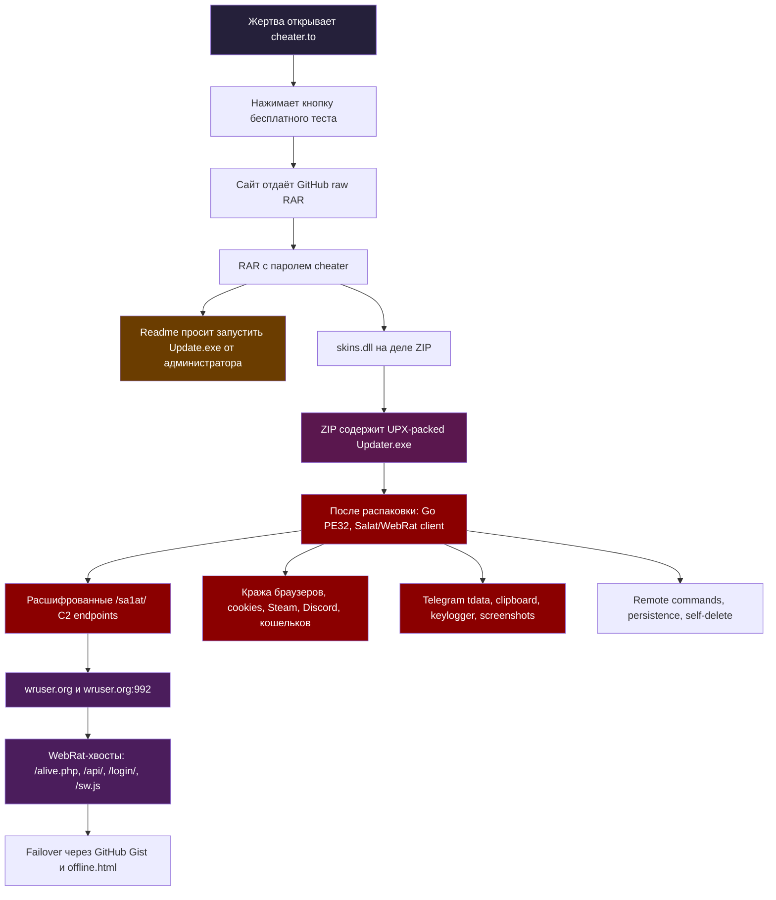

# cheater.to который "неожиданно" оказался Salat WebRat

## Осторожно

Это обычный мамин стилер/ратник, запакованный в архив с паролем и выданный за бесплатный тестовый период.

Пользователь сам запускает `Updater.exe`, потому что думает, что это часть чита. После запуска начинается кража всего подряд: браузеры, cookies, Discord/Steam-токены, криптокошельки, clipboard, скриншоты, keylogger, удалённые команды и C2.

Сэмпл в этом разборе **не исполнялся**. Только статика и аккуратные сетевые проверки. Часть работы делалась на хосте; повторять так не советую.

---

## Коротко

`cheater.to` продаёт "читы" и даёт "тест на 24 часа". При попытке получить тест сайт подсовывает архив:

```text
Update_2026-05-14.rar
password: cheater
```

Внутри лежит приманка:

```text
Client\Readme.txt
Client\Update.exe
Client\skins.dll
Client\Materials\dxwebsetup.exe
```

`skins.dll` внезапно не DLL, а ZIP-контейнер. Внутри и лежит настоящий `Updater.exe`.

Просто ZIP с переименованным расширением.

---

## Схема атаки



---

## Цепочка запуска

Цепочка короткая:

```text
cheater.to trial
  -> GitHub raw RAR
  -> пароль cheater
  -> Readme просит админский запуск
  -> skins.dll как ZIP
  -> UPX-packed Updater.exe
  -> Salat/WebRat client
  -> /sa1at/ C2
  -> кража браузеров, Telegram tdata, Steam/Discord, кошельков
```

Граница доверия тут самая обычная: пользователь думает, что скачал "чит", а на деле запускает чужой удалённый клиент с правами своей учётки, иногда ещё и от администратора. После запуска на машине появляется код, который умеет читать локальные профили браузеров, Telegram, Steam, Discord, clipboard и ходить на C2.

Что подтверждено локально:

```text
архив и вложенный исполняемый файл получены из цепочки cheater.to -> GitHub raw;
Updater.exe распаковывается из skins.dll, который оказался ZIP;
после UPX получается Go PE32;
адреса /sa1at/ расшифрованы статикой, без запуска;
wruser.org и wruser.org:992 есть в расшифрованном C2;
wruser.org связан с WebRat-обвязкой: /alive.php, /api/, /login/, /sw.js, /offline.html;
в бинаре есть функции/строки под кражу браузерных профилей, Telegram tdata, Steam/Discord, кошельки, keylogger, скриншоты и удалённые команды.
```

---

## Почему это именно SalatStealer

Это готовый сервисный стилер: клиент, C2, панель, резервные домены и продажа доступа. По статике видно знакомую поставку Salat/WebRat, просто прикрученную к приманке с читами.

- Go-based Windows infostealer / RAT.
- Часто упакован UPX.
- Известен как SalatStealer / WEB_RAT.
- Тянет браузерные credentials, cookies, autofill, криптокошельки, Telegram/Steam/Discord-сессии.
- Имеет surveillance-функции: keylogger, screenshots, webcam/mic в других вариантах.
- Использует persistence через Run keys / Scheduled Tasks.
- Это MaaS: готовый клиент, C2, панель и продажа доступа, а не самописный updater для чита.

Источники:

- [CYFIRMA: Unmasked Salat Stealer](https://www.cyfirma.com/research/unmasked-salat-stealer-a-deep-dive-into-its-advanced-persistence-mechanisms-and-c2-infrastructure/) — Go-стилер, UPX, Run keys, Scheduled Tasks, вмешательство в Defender exclusions, MaaS.
- [SonicWall: Understanding SalatStealer](https://www.sonicwall.com/blog/understanding-salatstealer-a-threat-actors-golang-stealer-toolset) — Go-малварь, UPX, сбор браузеров/файлов/кошельков, screenshots/keylogger.
- [ANY.RUN Malware Trends: SalatStealer](https://any.run/malware-trends/salat/) — WEB_RAT alias, MaaS, раздача через fake cracks/cheats, браузеры/кошельки/сессии приложений.
- [SOC Prime: Salat Stealer Analysis](https://socprime.com/active-threats/salat-stealer-analysis/) — QUIC/WebSocket/HTTP C2, TON fallback, keylogging, screenshots, SOCKS5.
- [Malpedia: win.salatstealer](https://malpedia.caad.fkie.fraunhofer.de/details/win.salatstealer) — Go crypto stealer, браузеры, wallets, Telegram, webcam/mic streaming.
- [MalwareBazaar: SalatStealer tag](https://bazaar.abuse.ch/browse/tag/SalatStealer/) — на 19 июня 2026 у тега больше тысячи sightings, firstseen 2025-03-01, lastseen 2026-06-17.
- [Hybrid Analysis: webrat.in/login](https://hybrid-analysis.com/sample/5493c7f4444b9f5b4e04f4ee581cb328ce9ab9911035c5a08ed2a81950d8dbe1/695780edf573648c6f06e1cb) — публичный sandbox-след web-панели WebRat.
- [Securelist: Webrat via GitHub](https://securelist.com/webrat-distributed-via-github/118555/) — распространение WebRat через fake PoC/эксплойты, до этого через cheats/cracks.

Чуваки взяли известный ратник/стилер и навайбкодили фиолетовый сайтик.

---

## Сайт

Основной домен:

```text
cheater[.]to
```

Страница продуктов отдаёт логику бесплатного теста. При нажатии на пробный период клиентская часть указывала на payload, размещённый через GitHub raw:

```text
hxxps://github[.]com/testnetru02/-/raw/refs/heads/main/myfolder/awakaap/Workspace/Update_2026-05-14.rar
```

Пароль к архиву:

```text
cheater
```

В старой логике сайта также встречался вариант:

```text
Update_2026.rar
password: cheatertv
```

Отдельная красота: на сайте прямо советуют отключать защиту перед установкой. Там буквально просят поверить в стиль "это не вирус, просто пожалуйста выключи антивирус, firewall, здравый смысл и, желательно, включи вебочку".

---

## Архив

### RAR

```text
File:   Update_2026-05-14.rar.bin
Size:   3,872,884 bytes
SHA256: A4E6487B6AE37F9C8579BA5FFE8E81C1A046200DC5619C77AFED1782CDD8962C
SHA1:   1B507E61750CF0C7CA2F89CA93F9401334D1F419
MD5:    522E4D9755AD2588D1A7E893F057A1C8
```

Архив был сохранён как `.bin`, ибо я люблю случайно тыкнуть куда попало.

### Содержимое

```text
Client\Readme.txt
Client\Update.exe
Client\skins.dll
Client\Materials\dxwebsetup.exe
```

`Readme.txt` на коленях умоляет запустить `Update.exe` от администратора и вырубить антивирус (блять фыххфыахыфахфыха)

## UPX

Внутренний `Updater.exe` оказался UPX-packed. 

После распаковки payload выглядит так:

```text
File:   Updater.unpacked.exe
Size:   12,573,184 bytes
SHA256: D8ED4BA2515A7867F6650B9A128A464E92765549201BFE94715967A843B906D5
MD5:    B52954C1DEFB0F2D48EBD937B3C16F23
Type:   PE32 Windows GUI
Lang:   Go
```

Ну это прям очень слабо

---

## VMRay по тому же SHA256

Тот же распакованный файл есть в публичном отчёте VMRay:

```text
SHA256: D8ED4BA2515A7867F6650B9A128A464E92765549201BFE94715967A843B906D5
Verdict: malicious
Class:   Spyware
Name:    SalatStealer
URL:     hxxps://www.vmray[.]com/analyses/_vt/d8ed4ba2515a/report/overview.html
```

В VMRay совпали те же `/sa1at/` адреса. Отдельно в отчёте отмечен `vmray_salatstealer_extractor`.

VMRay показал на запуске:

```text
Mutex:
Global\WEBR_CLMBI2WZW32H

Копия на диске:
C:\Program Files (x86)\Microsoft\spoolsv.exe
SHA256: 387C5A3DE4727165ACEE17CB48831D317B53EE29B80C4FA6B66AFAC9733D4805

Маскировка под explorer:
C:\Users\<user>\AppData\Local\Packages\explorer.exe
SHA256: 387C5A3DE4727165ACEE17CB48831D317B53EE29B80C4FA6B66AFAC9733D4805
```

После запуска `Updater.exe` кладёт копии под системно выглядящими именами, поднимает их, цепляет автозапуск и таскает за собой PowerShell/`svchost.exe`.

Сработавшие поведенческие признаки VMRay:

```text
schedule startup task
drop PE file
execute dropped PE file
drop PE masquerading as system utility
create fake explorer process
create PowerShell process with hidden commands
take screenshot using BitBlt API
read MachineGuid
access AMSI-related registry keys
timestomp
anti-sleep
install TCP/UDP server / loopback server
```

VMRay ещё срезал sleep примерно с 58 минут до 2 минут и делал reboot, потому что сэмпл поставил автозапуск. Для такого класса мусора это обычный сценарий: переждать, пережить перезапуск и продолжить жить уже из более приличного на вид пути.

---

## Расшифровка C2

В бинаре лежит набор зашифрованных C2-адресов. Они не торчат строками в лоб, но и не спрятаны так, чтобы их нельзя было на изи достать статикой.

Куски, которые отвечают за выбор и смену адреса:

```text
main.getEp
main.initConnection
main.changeEndpoint
main.tryTonResolve
main.tonResolve
```

Внутри есть несколько слоёв обфускации и AES-GCM. Адреса достаются без запуска:

### Расшифрованные C2

```text
hxxps://salator[.]es/sa1at/
hxxps://wruser[.]org/sa1at/
hxxps://websalat[.]top/sa1at/
hxxps://salat[.]cn/sa1at/
hxxps://wrat[.]in/sa1at/
hxxps://sa1atik[.]cn/sa1at/
hxxps://wruser[.]org:992/sa1at/
```

В IDA это видно как обращения к зашифрованным blob'ам, которые после расшифровки дают те же `/sa1at/` адреса:


Ещё видна логика DNS-over-HTTPS и резервных resolver'ов:

```text
hxxps://1.1.1.1/dns-query?name=
hxxps://cloudflare-dns[.]com/dns-query?name=
hxxps://dns[.]google/resolve?name=
```

Там же рядом лежит fallback на публичные DoH-resolver'ы:


И TON fallback:

```text
main.tryTonResolve
main.tonResolve
```

Фолбэки сделаны уже не совсем на коленке, но рядом в бинаре всё равно лежат читаемые Go symbol names.

---

## Где тут WebRat

Самый толковый pivot здесь — `wruser[.]org`.

Этот домен есть прямо в расшифрованном конфиге payload:

```text
hxxps://wruser[.]org/sa1at/
hxxps://wruser[.]org:992/sa1at/
```

Простой `GET/HEAD` на `/sa1at/` ничего интересного не отдаёт. На 19 июня 2026 картина была такая:

| Endpoint | Результат |
|---|---|
| `salator[.]es/sa1at/` | `403`, Cloudflare |
| `wruser[.]org/sa1at/` | `404`, Angie |
| `websalat[.]top/sa1at/` | `404`, Cloudflare |
| `salat[.]cn/sa1at/` | `404`, Cloudflare |
| `wrat[.]in/sa1at/` | не резолвился |
| `sa1atik[.]cn/sa1at/` | `404`, Cloudflare |
| `wruser[.]org:992/sa1at/` | `404`, Angie |

По `GET/HEAD` C2 выглядит закрытым или пустым, но это не запрос клиента. У живого обработчика есть свой метод, body, WebSocket/QUIC, токен, SNI/User-Agent или состояние backend'а, которое браузерный тык не повторяет.

А вот вокруг `wruser[.]org` уже всплывает WebRat-инфраструктура:

```text
wruser[.]org -> 2.59.219.233
server: Angie
open: 80/tcp, 443/tcp, 992/tcp
```

Порт `992` тут важен не сам по себе, а потому что он совпадает с endpoint из бинаря. Плюс на `443` и `992` висит один и тот же сертификат:

```text
CN=wruser.org
SANs=*.wrat.in, *.wruser.org, wrat.in, wruser.org
```

`wrat[.]in` не просто случайная строка из конфига. Он ещё и лежит в сертификате рядом с `wruser[.]org`.

На `wruser[.]org` и соседних WebRat-доменах всплыла уже не C2-ручка, а панельная обвязка:

```text
/alive.php     -> "im alive"
/api/          -> {"success":false,"result":"No auth"}
/login/        -> WEB_RAT login/captcha
/captcha       -> SVG captcha + cookie azi=<hex>
/sw.js         -> service worker
/offline.html  -> failover page + onion fallback
```

`/sw.js` отвечает за живучесть панели. Он перехватывает переходы на `/`, `/login`, `/panel`, `/userctl`, кеширует `/offline.html` и пытается перекинуть пользователя на живой домен, если текущий не отвечает.

Для failover он тянет список из GitHub Gist:

```text
hxxps://gist.githubusercontent[.]com/azigriffin/680de5baecb93afb150cf997f7b2dfc6/raw/sniff_domain_list.txt
```

На момент проверки там были:

```text
webrat.es
webrat.uk
```

В `offline.html` также светился onion. Это fallback из веб-обвязки, не C2 из бинаря. 19 июня 2026 живым он не подтвердился:

```text
webratxaye7bisbksue6pl4bupvgvyi7lmo2lux7mzxkhkcqu6wd6nid[.]onion
```

Отдельно по Telegram: прямой `api.telegram.org/bot...` или bot token в этом payload не найден. Telegram тут виден как цель кражи:

```text
\Telegram Desktop\tdata
LocalCache\Roaming\Telegram Desktop UWP\tdata
Clients\tdata
TelegramDesktop
```

То же место в IDA: обычный сбор `tdata`, без всякой магии.


На выходе дешёвая клиентская часть WebRat/Salat: рядом C2, панель, failover через GitHub и обвязка для людей, которые покупают доступ к кнопкам.

---

## Что крадёт

Начинается всё с браузеров. В сэмпле видны отдельные ветки для Chromium/Gecko, cookies, логинов, autofill и master key. Под раздачу попадают не только Chrome и Edge, но и привычный набор Chromium-форков:

```text
Chrome
Edge
Brave
Firefox
Opera / Opera GX
Yandex
Vivaldi
Chromium forks
```

Есть код под Chrome App-Bound encryption, Brave/Edge, Gecko decrypt и прочую радость.

Внутри это выглядит ровно так, как и ожидается от стилера: `Login Data`, cookies SQL и дальнейшая обработка результата.


Дальше идут Discord и Steam. Внутри встречаются имена выходных файлов `Clients\DiscordTokens.txt` и `Clients\SteamTokens.txt`, а для Steam привычные `loginusers.vdf`, `config.vdf`, `local.vdf` и registry path `SOFTWARE\Valve\Steam`.

Кошельки тоже в списке. Вот часть целей:

```text
Exodus
AtomicWallet
Electrum
Metamask
Phantom
Binance
Coinomi
TonKeeper
MyTonWallet
Trust Wallet
Guarda
Keplr
Ronin
Yoroi
Rabby
```

Всё до отупения просто 

Плюсом идут clipboard, keylogger, screenshots/screen stream, remote shell, download file, persistence, self-delete и LSASS-related куски.

---

## Системная разведка

Внутри видны WMI-запросы и сбор системной информации:

```text
select Name from Win32_Processor
Select Name from Win32_VideoController
select TotalPhysicalMemory from Win32_ComputerSystem
Select caption,volumename,drivetype,freespace,size from Win32_LogicalDisk
```

И список системных процессов:

```json
[
  "explorer.exe",
  "svchost.exe",
  "smss.exe",
  "csrss.exe",
  "services.exe",
  "lsass.exe",
  "taskhostw.exe",
  "taskhost.exe",
  "audiodg.exe",
  "wininit.exe",
  "spoolsv.exe",
  "dwm.exe"
]
```

Этот список малварь держит отдельно. Без запуска точную ветку не называю: факт списка есть, как именно он используется - вопрос к рантайму.

---

## MITRE ATT&CK

| Tactic | Technique | Признак |
|---|---|---|
| Execution | T1204.002 User Execution | Архив с Readme просит запустить updater |
| Defense Evasion | T1027 Obfuscated/Compressed Files | UPX-packed payload |
| Defense Evasion | T1036 Masquerading | `skins.dll` как ZIP, updater-like names |
| Persistence | T1053.005 Scheduled Task | `main.newTask`, taskmaster |
| Persistence | T1547.001 Run Keys / Startup | типично для Salat, публично описано CYFIRMA |
| Credential Access | T1555.003 Credentials from Web Browsers | Chrome/Gecko credential functions |
| Credential Access | T1003.001 LSASS Memory | LSASS-related functions/strings |
| Collection | T1056.001 Keylogging | keylogger functions |
| Collection | T1113 Screen Capture | screenshot/screenStream functions |
| Collection | T1115 Clipboard Data | `main.getClipboardText` |
| Command and Control | T1071 Web Protocols | HTTPS C2 endpoints |
| Command and Control | T1008 Fallback Channels | endpoint rotation, DoH, TON resolver |
| Exfiltration | T1041 Exfiltration Over C2 Channel | stealer architecture + C2 |

---

## Почему схема с "читами" работает

Потому что аудитория сама идёт навстречу:

1. Читы стоят денег и дают преимущество над другими игроками.
2. Пользователь заранее готов отключить защиту, потому что думает, что это протект чита от реверса или античита.
3. Архив с паролем снижает детекты антивирусов. (не знаю как с этим в 26 году)
4. GitHub raw выглядит довереннее, чем `malware-hosting-228[.]top`.
5. Readme объясняет вредоносные признаки как "false positive".

Социальная инженерия тут дешёвая, но по аудитории попадает. У авторов не интеллект выше, просто у жертвы мотивация сильнее осторожности.

---

## IOC

### Domains

```text
cheater[.]to
salator[.]es
wruser[.]org
websalat[.]top
salat[.]cn
wrat[.]in
sa1atik[.]cn
cloudflare-dns[.]com
dns[.]google
```

`cloudflare-dns[.]com` и `dns[.]google` сами по себе легитимные. В IOC они попали только из-за resolver/fallback-логики этого сэмпла.

### WebRat / panel pivots

```text
wruser[.]org
wrat[.]in
webrat[.]org
webrat[.]es
webrat[.]uk
webrat[.]top
webr[.]at
webrat[.]ru
zvzvgoida[.]cn
```

```text
2.59.219.233    wruser[.]org direct host
57.129.43.114   webrat[.]org / webrat[.]es / webr[.]at direct host
```

### URLs

```text
hxxps://salator[.]es/sa1at/
hxxps://wruser[.]org/sa1at/
hxxps://websalat[.]top/sa1at/
hxxps://salat[.]cn/sa1at/
hxxps://wrat[.]in/sa1at/
hxxps://sa1atik[.]cn/sa1at/
hxxps://wruser[.]org:992/sa1at/
```

Panel/failover:

```text
hxxps://wruser[.]org/alive.php
hxxps://wruser[.]org/api/
hxxps://wruser[.]org/login/
hxxps://wruser[.]org/sw.js
hxxps://wruser[.]org/offline.html
hxxps://webrat[.]org/alive.php
hxxps://webrat[.]es/alive.php
hxxps://webrat[.]uk/alive.php
hxxps://webrat[.]top/alive.php
hxxps://gist.githubusercontent[.]com/azigriffin/680de5baecb93afb150cf997f7b2dfc6/raw/sniff_domain_list.txt
```

Onion из `offline.html`, live не подтверждён:

```text
webratxaye7bisbksue6pl4bupvgvyi7lmo2lux7mzxkhkcqu6wd6nid[.]onion
```

TLS pivots:

```text
wruser/wrat cert SHA256:
c21142b4d69dee365e3b02109f059e3dd0ae0315e8b29d8d6e62e72af3d556b8
SANs: *.wrat.in, *.wruser.org, wrat.in, wruser.org

webrat direct cluster cert SHA256:
05f83707e964a99b43d97e5beb6f345ba9fac444a84e9012edd0fde97cab395e
SANs: webr.at, webrat.es, webrat.org
```

### Доставка payload

```text
hxxps://github[.]com/testnetru02/-/raw/refs/heads/main/myfolder/awakaap/Workspace/Update_2026-05-14.rar
```

### Hashes

```text
A4E6487B6AE37F9C8579BA5FFE8E81C1A046200DC5619C77AFED1782CDD8962C  Update_2026-05-14.rar
489B39A5DBF2679BD9A4C4B08CC1A367BE51F44CB80F4C30F084D5503B2E4991  skins.dll ZIP payload
FFCB7944200B7BD402D9F555E054980F40126D059E0A0FE2B60486DD0C758312  packed Updater.exe
D8ED4BA2515A7867F6650B9A128A464E92765549201BFE94715967A843B906D5  UPX-unpacked Updater.exe
387C5A3DE4727165ACEE17CB48831D317B53EE29B80C4FA6B66AFAC9733D4805  VMRay copy on disk: spoolsv.exe / explorer.exe
0B0791877B137B46022EC548F76D824983206F32EC58D8CB20A3A21B9F1A06A9  Client\Update.exe
92F25A46E5AFCBA7FE02EACEDC29E8BB613A6D575B2C41D2584F67E6CC211E80  related ANY.RUN sample
```

### Mutex

```text
Global\WEBR_CLMBI2WZW32H
```

### Интересные строки / файлы

```text
Clients\DiscordTokens.txt
Clients\SteamTokens.txt
SOFTWARE\Valve\Steam
loginusers.vdf
config.vdf
$LOCALAPPDATA\steam\local.vdf
Clipboard:
lsass.exe not found
failed to impersonate SYSTEM: %v
```

### Functions

```text
main.getEp
main.getBC
main.initConnection
main.changeEndpoint
main.tryTonResolve
main.tonResolve
main.Steal
main.getChromeLogins
main.getChromeCookies
main.getGeckoLogins
main.getDiscord
main.getSteams
main.runKeylogger
main.screenStream
main.downloadFile
main.executeCommand
main.shellCommand
main.staticinstall
main.newTask
main.selfDelete
```

### YARA

Для unpacked `Updater.exe` добавлено отдельное campaign-specific правило:

```text
yara/cheater_to_salatstealer_campaign.yar
```

Это не дубль generic-правил про браузерные папки, SQL-запросы или wallet extension ID. Правило цепляется за то, что досталось именно из этого образца: набор Go-символов `main.getEp`, `main.tryTonResolve`, `main.staticinstall`, `main.selfDelete`, steal/RAT-функции и prefix'ы зашифрованных C2 blob'ов.

Plaintext-домены и `Global\WEBR_CLMBI2WZW32H` в условие не добавлялись: домены в файле лежат зашифрованными, а mutex подтверждён через sandbox/runtime-след, но не как обычная ASCII-строка внутри unpacked payload.

---

## Проверка и защита

Для этого кейса отдельно подготовлен PowerShell guard:

```text
cheater_to_guard.ps1
```

Режим проверки:

```powershell
powershell -ExecutionPolicy Bypass -File .\cheater_to_guard.ps1 -Mode Check
```

Режим установки блоков:

```powershell
powershell -ExecutionPolicy Bypass -File .\cheater_to_guard.ps1 -Mode Install
```

Если нужно сохранить локальные сэмплы для анализа и не отправлять их в карантин:

```powershell
powershell -ExecutionPolicy Bypass -File .\cheater_to_guard.ps1 -Mode Install -NoQuarantine
```

Что делает guard:

- добавляет известные C2-домены в `hosts`;
- включает Defender PUA Protection;
- включает Defender Network Protection;
- включает ASR-правило для неизвестных executable-файлов;
- ищет известные SHA256 в Downloads/Desktop/Temp;
- при обычном `Install` переносит найденные сэмплы в карантин.

Guard закрывает только эту цепочку и известные IOC. Для другой сборки его надо обновлять.

---

## Что делать, если запускали

Если `Updater.exe` запускался:

1. Изолировать машину от сети.
2. Не вводить пароли на этой системе.
3. С другого чистого устройства сменить пароли:
   - почта;
   - Steam;
   - Discord;
   - криптокошельки;
   - браузерные аккаунты;
   - GitHub/Telegram/банки.
4. Отозвать активные сессии в сервисах.
5. Проверить scheduled tasks, Run keys, Downloads/Temp/AppData.
6. Снять образ/логи, если нужен форензик.
7. При сомнениях переустановить систему.

Если в браузере были seed phrases, приватные ключи или кошельки — считать их скомпрометированными.

---

## Итог

`cheater.to` раздаёт не просто подозрительный архив. Цепочка ведёт к UPX-packed Go payload с SalatStealer / WEB_RAT внутри: зашифрованные C2, кража браузеров и сессий, кошельки, Discord/Steam, keylogger, screenshots, remote commands, persistence и self-delete.

Технически это мусор. Конструктор, запихнутый в архив с паролем и прикрытый сайтом, который выглядит так, будто его собирали промптом "сделай тёмный SaaS для читов, побольше фиолетового". Но даже такой бред ворует настоящие аккаунты, деньги и сессии.

Итог:

```text
cheater.to trial payload = SalatStealer / WEB_RAT infostealer-backdoor
Do not run.
Block C2.
Rotate credentials if executed.
```
